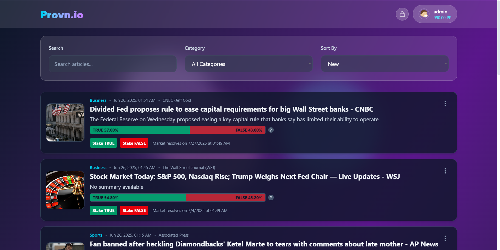
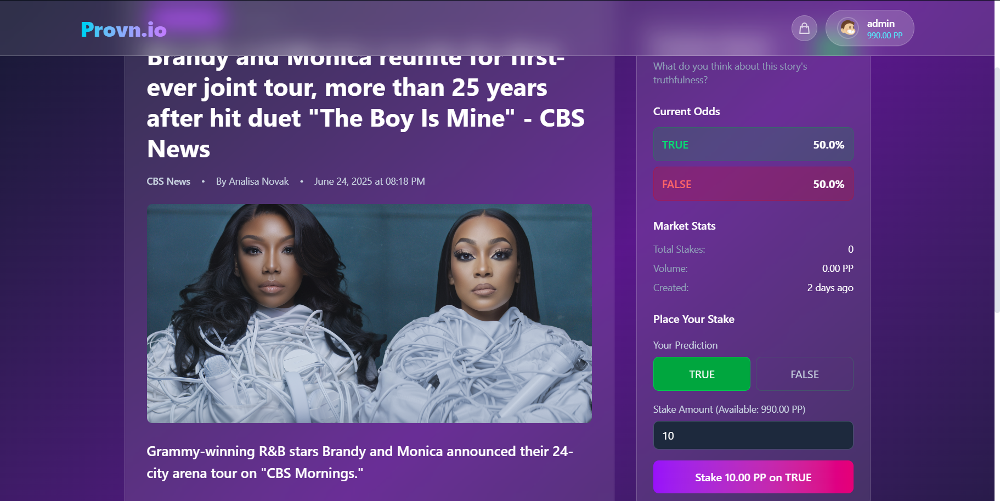
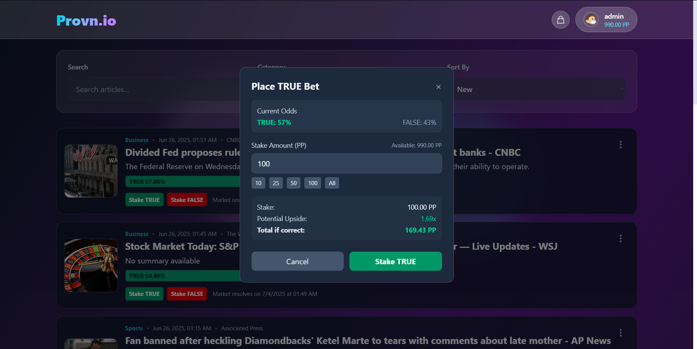
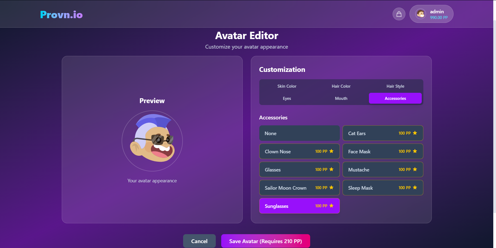
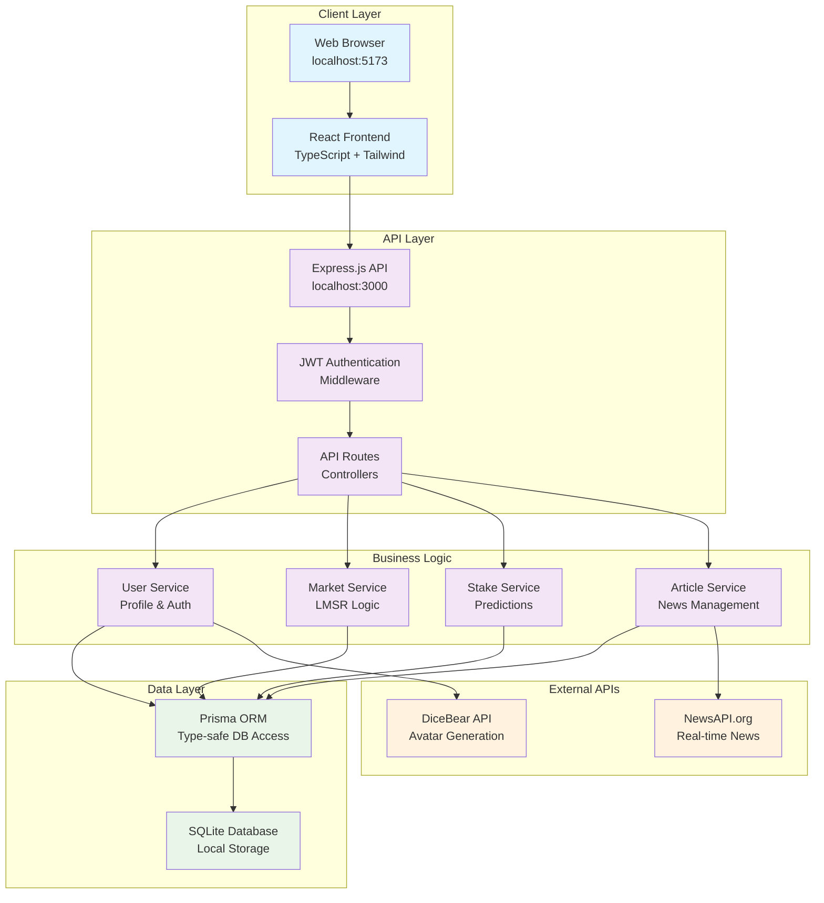
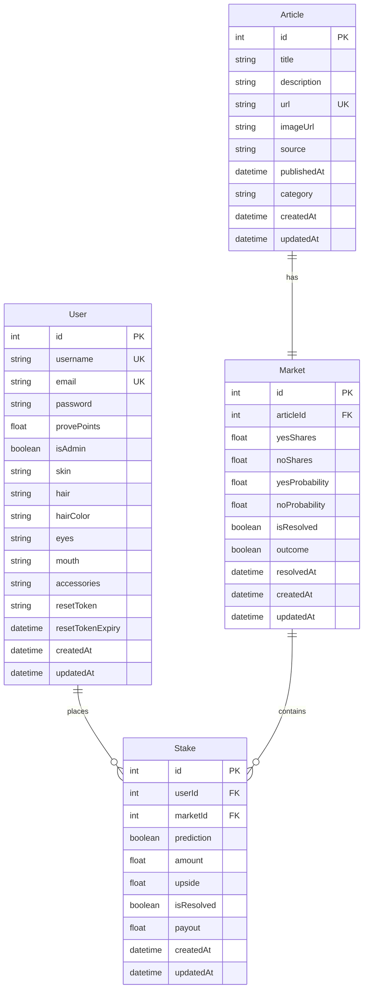

<div align="center">
  <h2><strong>Provn.io: Crowdsourcing news verification</strong></h2>
</div>


Provn.io is a prediction markets platform for news verification that harnesses the collective intelligence of online users to dramatically scale verification efforts through prediction markets. We mobilise users by giving them a stake in truthfulness, encouraging them to stake virtual ProvePoints to predict whether claims in news articles are true or fake. 

Not only does this allow us to gauge crowd sentiment about the veracity of news, but it also encourages users to be thorough before staking their claims on stories. By mobilising collective efforts to detect fake news, fact-checking on Provn.io becomes not just an exercise, but a culture.- 

<div>
  <h2><strong>All your news, in one place</strong></h2>
</div>



<div>
  <h2><strong>Deep dive into each article, while tracking how much readers trust its claims</strong></h2>
</div>



<div>
  <h2><strong>Help verify articles for others while you browse, and get rewarded!</strong></h2>
</div>



<div>
  <h2><strong>Accumulate ProvePoints with your predictions to unlock new profiles!</strong></h2>
</div>



## Table of Contents

### Introduction
- [Motivation](#motivation) - Why Provn.io?
- [Core Features](#core-features) - Overview of all platform capabilities
- [Upcoming Features] (#upcoming-features) - Upcoming features for Milestone 3
- [Tech Stack](#tech-stack) - Technologies and frameworks used
- [Getting Started](#getting-started) - Installation and setup instructions
- [User Accounts & Testing](#user-accounts--testing) - Test accounts and registration

### Understanding Key Features
- [News Search Tools](#news-search-tools) - Search, filter, and search tools to craft your reading experience
- [Understanding Prediction Markets](#understanding-prediction-markets) - How markets work
- [Staking Process](#staking-process) - Step-by-step guide to making predictions
- [Avatar System](#avatar-system) - Avatar customization guide

### Technical Details
- [Project Structure](#project-structure) - Codebase organization
- [Database Schema](#database-schema) - Data model overview
- [API Endpoints](#api-endpoints) - Complete API documentation
- [Development & Testing](#development--testing) - Development workflows
- [User Journey](#user-journey) - Step-by-step user experience flow
- [Future Enhancements](#future-enhancements) - Planned features and improvements

### Miscellaneous
- [Frequently Asked Questions](#frequently-asked-questions) - Answering FAQs on our project
- [Contributing](#contributing) - How to contribute to the project
- [Authors](#authors-and-acknowledgments) - Project contributors


## Motivation

In today's digital landscape, **misinformation spreads faster than wildfire**, while traditional fact-checking struggles to keep pace. News outlets, social media platforms, and readers all face the same challenge: **How do we quickly and accurately determine what's true?**

### The Problem
- **Overwhelming Volume**: Thousands of news articles are published daily across countless sources
- **Speed vs. Accuracy**: Traditional fact-checking is thorough but slow, often taking days or weeks, while nascent AI solutions like Grok come with the risks of hallucinations

**The result? In this sea of information, readers increasingly struggle to know which sources to trust.**

Even major political figures may not always put forth trustable claims: Trump's declaration of a ceasefire in the Middle East was refuted 2 hours later by Iran, although a ceasefire did eventually come into effect soon after.


### Our Solution: Crowdsourced Truth
Provn.io harnesses **crowd wisdom** through prediction markets, creating a scalable, real-time verification system:

- **Collective Intelligence**: Multiple users with diverse backgrounds contribute their knowledge and analysis
- **Real-time Processing**: Markets provide instant feedback on article credibility as news breaks
- **Skin in the Game**: Users stake ProvePoints on their predictions, incentivizing accuracy over speed
- **Probability-based Truth**: Instead of binary true/false, we provide nuanced probability scores
- **Self-correcting**: Markets automatically adjust as new information emerges

### Why Prediction Markets Work
Research consistently shows that prediction markets are among the most accurate forecasting mechanisms available. By **monetizing accuracy**, we create powerful incentives for users to:
- Research thoroughly before staking
- Update their predictions based on new evidence  
- Contribute specialized knowledge in their areas of expertise

**The result?** A scalable, democratic approach to news verification that grows more accurate as more people participate.

## Core Features

### User Accounts & Authentication
- **User Account Creation**: Robust signup with email validation, password strength requirements, and duplicate prevention
- **Secure Authentication**: JWT-based authentication with proper password hashing, input validation, and protection against common attacks
- **Profile Management**: User profile pages with personalized statistics and staking history
- **Admin Features**: Administrative controls for determining veracity of new articles and resolving markets as needed

### News Integration & Article Management
- **Real-time News Fetching**: Integration with NewsAPI.org for fetching real-world news articles
- **Article Display**: Rich article cards with source attribution, publication dates, and category tags
- **Diverse Categories**: Articles across business, entertainment, health, science, sports, and technology
- **Search & Sorting**: Filter articles by keyword search and sort for new, trending, trusted, or contentious articles

### Prediction Markets System
- **Automatic Market Creation**: Prediction markets are automatically created for each news article, allowing users to predict TRUE or FALSE on news article claims
- **Completely Liquid Markets**: Users place stakes with the Provn.io platform directly, instead of staking against other users, which allows stakes to be placed quickly and easily with Provn.io's automated market making
- **Real-time Probability Updates with LMSR**: Market probabilities predicting the veracity of news with the Logarithmic Market Scoring Rule update dynamically based on user stakes
- **Market Statistics**: Comprehensive statistics showing total participants, stake amounts, and probability distributions
- **Market Resolution**: Admin-controlled market resolution with automatic payout calculation

### ProvePoints Economy
- **Virtual Currency**: ProvePoints (PP) serve as the platform's staking currency
- **Starting Balance**: New users receive 100 PP to begin participating
- **Stake-based Wagering**: Users stake PP on their predictions with dynamic upside calculations
- **Winning Payouts**: Automatic distribution of winnings based on market outcomes and LMSR calculations
- **Balance Management**: Real-time balance updates and insufficient funds protection

### Avatar Customization System
- **DiceBear Integration**: Avatar system powered by DiceBear's "big-smile" style
- **Comprehensive Customization**: Skin color, hair color, hair style, eyes, mouth, and accessories
- **Real-time Preview**: Instant preview of avatar changes in the editor
- **Global Display**: Avatars appear throughout the app (navbar, profile, stakes history)
- **Premium Features**: PP-gated premium avatar options, rewarding users for correct predictions with cosmetic features to customise their profile

## Upcoming Features
- **Stake Management**: Allow users to interact with the "My Stakes" segment of the Profile Page, and ensure that stakes are properly distributed to users upon market resolution
- **User Generated Articles**: Allow users to publish their own articles attributed to their profiles on the platform, allowing our platform to host developing news stories that are validated with our prediction market system. Users can post their own corroborations and explainers giving larger contexts around news stories.
- **Automatic Market Closure**: Allow markets to resolve by their stipulated times automatically instead of relying upon admin verification.
- **Simulated Markets**: Use bot accounts following simple algorithms to stake on news articles, increasing trading volume in order to more effectively display Provn.io's user experience once a userbase has been built.
- **ProvePoint Injections**: Implement monthly ProvePoint injections to ensure users who have lost ProvePoints on staking activities have enough ProvePoints to continue enjoying Provn.io

## Tech Stack

### Frontend
- **React 19** with TypeScript for type-safe component development
- **Tailwind CSS** for modern, responsive styling with custom glass-morphism effects
- **Vite** for fast development builds and hot module replacement
- **React Router** for client-side routing and navigation
- **React Hot Toast** for user notifications and feedback

### Backend
- **Node.js** with Express.js for RESTful API development
- **TypeScript** for full-stack type safety
- **Prisma ORM** with SQLite database for data persistence
- **JWT** for stateless authentication
- **bcrypt** for secure password hashing
- **CORS** for cross-origin resource sharing

### External Integrations
- **NewsAPI.org** for real-time news article fetching
- **DiceBear API** for avatar generation and customization

## Getting Started

### Prerequisites
- Node.js (version 16 or higher)
- npm or yarn package manager
- SQLite3 (for database)

### Installation & Setup

1. **Clone the repository**
   ```bash
   git clone <repository-url>
   cd provn-orbital25
   ```

2. **Install dependencies**
   ```bash
   npm run install:all
   ```
   This installs dependencies for the root, backend, and frontend.

3. **Environment Configuration**
   
   **Backend Setup:**
   - Copy `backend/.env.example` to `backend/.env`
   - Configure your environment variables:
     ```env
     DATABASE_URL="file:./prisma/dev.db"
     JWT_SECRET="your-jwt-secret-key"
     NEWS_API_KEY="your-newsapi-key-from-newsapi.org"
     ```

   **News API Setup:**
   - Visit [NewsAPI.org](https://newsapi.org/) and create a free account
   - Get your API key and add it to the `.env` file
   - Free tier provides 1,000 requests per day

4. **Database Setup**
   ```bash
   cd backend
   npx prisma generate
   npx prisma db push
   ```

5. **Create Initial Data**
   ```bash
   # Create admin user (username: admin, password: password123)
   node scripts/createAdminUser.js
   
   # Create test user (username: testuser, password: password123)
   node scripts/createTestUser.js
   
   # Fetch real news articles and create markets
   node scripts/fetchRealNews.js
   ```

6. **Start Development Servers**
   ```bash
   # From root directory - starts both backend and frontend
   npm run dev
   
   # Or start individually:
   npm run dev:backend   # Backend on http://localhost:3000
   npm run dev:frontend  # Frontend on http://localhost:5173
   ```

7. **Access the Application**
   - **Frontend**: http://localhost:5173
   - **Backend API**: http://localhost:3000
   - **Database Browser**: Run `npx prisma studio` in backend directory (http://localhost:5555)

### Available Scripts

**Root Level:**
- `npm run dev` - Start both backend and frontend in development mode
- `npm run build` - Build both backend and frontend for production
- `npm run test` - Run tests for both backend and frontend
- `npm run install:all` - Install dependencies for all packages

**Backend Scripts:**
- `npm run dev` - Start backend development server with hot reload
- `npm run build` - Build backend for production
- `npm test` - Run backend tests

**Frontend Scripts:**
- `npm run dev` - Start frontend development server
- `npm run build` - Build frontend for production
- `npm run preview` - Preview production build

## User Accounts & Testing

### Test User Accounts

For testing and development purposes, you can use these pre-configured accounts:

#### Regular Test User
- **Username:** `testuser`
- **Email:** `test@example.com`
- **Password:** `password123`
- **Starting Balance:** 100 PP

#### Admin User
- **Username:** `admin`
- **Email:** `admin@example.com`
- **Password:** `password123`
- **Starting Balance:** 10,000 PP
- **Admin Features:** Market resolution, user management

These accounts come pre-configured with initial ProvePoints and can be used to:
- Test the authentication system
- Explore prediction markets and staking
- Test avatar customization features
- View performance analytics
- (Admin only) Resolve markets and manage content

### Creating Your Own Account
You can also register a new account through the registration page, which provides:
- 100 PP starting balance
- Full access to all platform features
- Persistent data storage
- Avatar customization options

## News Search Tools

Provn.io provides powerful search and filtering capabilities to help you find the news articles that matter most to you: 

- **Search Bar**: Using keyword search, find specific articles by searching for terms, phrases, or topics
- **Category Filtering**: Filter by news categories including: Business & Finance, Entertainment & Media, Health & Medicine, Science & Technology, Sports & Recreation, or just General News!

### Sorting Options
- **Newest First**: See the latest breaking news and developments
- **Trending**: Articles with the most user engagement and activity
- **Most Trusted**: Articles with high probability scores indicating credibility
- **Most Contentious**: Articles with close to 50/50 market probabilities

These tools help you quickly find articles that match your interests and expertise, making it easier to make informed predictions in areas where you have knowledge.

## Understanding Prediction Markets

### How Markets Work
In essence, prediction markets function by comparing the number of "shares" bought for each outcome, TRUE or FALSE. Thus, by comparing the stakes each reader places for each article, each market can suggest a probability of the article containing trustable claims by gauging crowd sentiment: if 999 of 1000 readers think that the article is true, it probably is!

To avoid a small number of votes from disrupting the market too heavily, we set a high liquidity parameter and limit the possibility for market manipulation. Nevertheless, we continue to advise users to exercise their own discretion when reading claims in every news article.

Here's a snippet of our code that predicts the probability of fake news:
```
// Calculates LMSR odds for a given market.
// LIQUIDITY = 1000; this means 1000PP moves the probabilities from 50% to 73%, and 2000PP moves it to 88%.
  async getImpliedProbability(marketId: number): Promise<{ probTrue: number; probFalse: number }> {
    const market = await this.getMarketById(marketId);
    const expTrue = Math.exp(market.sharesTrue / LIQUIDITY);
    const expFalse = Math.exp(market.sharesFalse / LIQUIDITY);
    const denom = expTrue + expFalse;

    return {
      probTrue: expTrue / denom,
      probFalse: expFalse / denom,
    };
  }
```

## LMSR Logic in Our Prediction Markets

Our platform uses the **Logarithmic Market Scoring Rule (LMSR)** as the automated market maker for all prediction markets. LMSR is a popular mechanism for prediction markets because it provides continuous liquidity and automatically adjusts prices (probabilities) based on the stakes placed by users. This ensures that users can easily place stakes at any time, while also allowing the platform to detect shifts in sentiment—**serving as an early warning system for potential misinformation.**

### How LMSR Works

- **Shares System:**  
  In a traditional LMSR market, users buy and sell "shares" in possible outcomes. The price of each share is determined by the current distribution of shares and the market's liquidity parameter. As more shares are bought for an outcome, its implied probability (and price) increases.

- **Price Calculation:**  
  The LMSR formula ensures that the cost to move the market probability increases as the market becomes more certain. This prevents any single user from drastically moving the market with a small stake.

### User-Friendly Abstraction

To make the experience more intuitive, we **abstract away the concept of shares**. Instead, users interact with the market using **ProvePoints (PP)**, our platform's staking currency.

- **Direct Upside Visualization:**  
  When a user stakes ProvePoints on an outcome, the platform calculates and displays their **expected upside** (potential gain per PP staked) using the underlying LMSR math. This means users don't need to understand or manage shares—they simply see how much they stand to gain if their prediction is correct.

- **Behind the Scenes:**  
  - When a user stakes, the system uses LMSR to determine how many "virtual shares" their stake would buy.
  - The market's probabilities (odds) are updated based on the new share distribution.
  - The user's upside is calculated and shown directly, making the process transparent and user-friendly.

### Example

Suppose the market is 50/50 and you stake 100 PP on "Yes":
- The system calculates, via LMSR, how much this moves the probability.
- You immediately see your **upside per PP** and the new market odds.
- No need to worry about shares or complex formulas—just stake and see your potential reward.

## Staking Process

Making predictions on Provn.io is designed to be intuitive and rewarding. Here's your complete guide to staking:

### Step-by-Step Staking Guide

#### 1. **Conduct Thorough Research**
- Read the news article fully
- Consult other news sources to ensure that its claims can be trusted
- Check the current probability and market activity to evaluate if the market probability matches your assessment

#### 2. **Make Your Prediction**
- Click either **"TRUE"** or **"FALSE"** based on your analysis
- Enter how many ProvePoints you want to stake (minimum 1 PP)
- **View Upside**: See your potential return multiplier in real-time

#### 3. **Place Your Stake!**
```
Your Prediction: TRUE
Stake Amount: 25 PP
Current Odds: 1.7x
Potential Return: 42.5 PP
Net Profit: 17.5 PP
```
- Double-check all details before confirming
- Click **"Place Stake"** to submit your prediction

#### 4. **Track Your Position**
- Your stake appears immediately in your Profile page
- Monitor market probability changes in real-time
- Watch as new information affects market sentiment
- Receive notifications when markets are resolved

#### 5. **Receive Your Reward**
- Receive bonus PP if you were correct
- Lose your staked amount if you were wrong

## Avatar System

Provn.io features a comprehensive avatar customization system powered by DiceBear's "big-smile" style. The cosmetic options unlock as you earn more and more ProvePoints, allowing you to show off your astute predictions in style to everyone!

### How to Customize Your Avatar
1. Navigate to your Profile page or click "Avatar Shop" in the navigation
2. Click on your current avatar image or use the Avatar Editor page
3. Choose from different customization categories (skin, hair, eyes, mouth, accessories)
4. Premium features require sufficient ProvePoints to unlock
5. Save your changes to update your profile across the platform

## Project Structure

### System Architecture Diagram



### Directory Structure

```
provn-orbital25/
├── backend/                    # Node.js Express API server
│   ├── prisma/                # Database schema and migrations
│   ├── scripts/               # Utility scripts for data management
│   ├── src/
│   │   ├── controllers/       # API route handlers
│   │   ├── middleware/        # Authentication and validation
│   │   ├── routes/           # API route definitions
│   │   ├── services/         # Business logic (Markets, Stakes, Users)
│   │   └── tests/            # Unit and integration tests
│   └── public/               # Static files and test pages
├── frontend/                  # React TypeScript application
│   ├── public/               # Static assets
│   └── src/
│       ├── components/       # Reusable UI components
│       ├── contexts/         # React context providers
│       ├── pages/           # Page components
│       ├── services/        # API communication
│       └── utils/           # Helper functions and types
└── shared/                   # Shared TypeScript types
```

## Database Schema

### Database Entity Relationship Diagram (ERD)

The application uses SQLite with Prisma ORM. Key models include:

### User Model
- Authentication data (username, email, password)
- ProvePoints balance and admin status
- Avatar configuration (skin, hair, eyes, mouth, accessories)
- Timestamps and reset tokens

### Article Model
- News article content (title, description, URL, image)
- Source attribution and publication date
- Category classification
- Associated prediction market

### Market Model
- Article association and outcome tracking
- LMSR parameters (shares, probabilities)
- Resolution status and timestamps
- Associated stakes

### Stake Model
- User prediction and stake amount
- Upside calculation and resolution status
- Market and user associations
- Creation timestamp



#### Sample Data Examples:
- **User**: `{ username: 'testuser', email: 'test@example.com', provePoints: 100.00, isAdmin: false }`
- **Article**: `{ title: 'Breaking News...', source: 'BBC News', category: 'technology' }`
- **Market**: `{ yesShares: 50.0, noShares: 50.0, yesProbability: 0.5, isResolved: false }`
- **Stake**: `{ prediction: true, amount: 10.0, upside: 1.95, isResolved: false }`

## API Endpoints

### Authentication Endpoints
- `POST /api/auth/register` - Register new user account
- `POST /api/auth/login` - User login with email/username and password
- `GET /api/auth/profile` - Get current user profile (protected)
- `PUT /api/auth/profile` - Update user profile (protected)
- `PUT /api/auth/update-avatar` - Update user avatar configuration (protected)

### Article Endpoints
- `GET /api/articles` - Get all articles with optional filtering
- `GET /api/articles/categories` - Get available article categories
- `POST /api/articles/refresh` - Fetch new articles from News API (admin)

### Market Endpoints
- `GET /api/markets` - Get all prediction markets
- `GET /api/markets/:id` - Get specific market by ID
- `GET /api/markets/:id/staking-parameters` - Calculate staking parameters for a prediction
- `PUT /api/markets/:id/resolve` - Resolve market outcome (admin)
- `PUT /api/markets/:id/admin-resolve` - Admin resolve market (admin)

### Stake Endpoints
- `POST /api/stakes` - Create new stake (protected)
- `GET /api/stakes/user` - Get current user's stakes (protected)
- `GET /api/stakes/market/:marketId` - Get stakes for specific market
- `GET /api/stakes/stats/:marketId` - Get market statistics

### User Endpoints
- `GET /api/users/me` - Get current user details (protected)
- `GET /api/users/stats` - Get platform statistics

## Development & Testing

### Testing the System
1. **Authentication Testing**
   ```bash
   cd backend
   node test-auth.js
   ```

2. **News API Testing**
   ```bash
   cd backend
   node scripts/testNewsAPI.js
   ```

3. **Stake Integration Testing**
   ```bash
   cd backend
   node scripts/testStakeIntegration.js
   ```

### Database Management
- **View Database**: Run `npx prisma studio` in backend directory
- **Reset Database**: Delete `backend/prisma/dev.db` and run `npx prisma db push`
- **Backup Database**: Copy `backend/prisma/dev.db` file

### Environment Variables
Ensure your `backend/.env` file contains:
```env
DATABASE_URL="file:./prisma/dev.db"
JWT_SECRET="your-secure-jwt-secret-key"
NEWS_API_KEY="your-newsapi-key"
PORT=3000
```

## User Journey

### Detailed User Flow Steps

#### 1. **New User Onboarding**
```
Landing Page → Registration → Welcome Email → Dashboard
↓
• User sees compelling banner and feature gallery
• Creates account with email/username/password
• Receives 100 ProvePoints starting balance
• Guided tour of main features
```

#### 2. **First Article Interaction**
```
News Page → Article Selection → Market Analysis → Stake Decision
↓
• Browse real-time news articles
• Click article to view details and market
• See current probability (e.g., 65% TRUE, 35% FALSE)
• Analyze potential upside calculations
```

#### 3. **Making Predictions**
```
Stake Interface → Amount Input → Confirmation → Market Update
↓
• Choose TRUE or FALSE prediction
• Set ProvePoints stake amount (e.g., 20 PP)
• View upside potential (e.g., 1.5x return)
• Confirm stake and see updated market odds
```

#### 4. **Profile & Progress Tracking**
```
Profile Page → Stakes History → Performance Analytics → Avatar Shop
↓
• View total PP balance and earnings
• Track active and resolved stakes
• See win/loss ratios and accuracy stats
• Access avatar customization options
```

#### 5. **Avatar Customization Flow**
```
Avatar Editor → Feature Selection → PP Check → Preview → Save
↓
• Select customization category (hair, eyes, etc.)
• Check PP requirements for premium features
• Preview changes in real-time
• Save configuration to profile
```

#### 6. **Market Resolution & Payouts**
```
Admin Resolution → Automatic Calculation → Payout Distribution → Balance Update
↓
• Admin resolves market based on real outcomes
• LMSR calculates winnings for correct predictions
• ProvePoints automatically distributed
• User notified of winnings/losses
```

### User Personas & Journeys

#### **The Analyst** - Sarah, News Enthusiast
- **Goal**: Earn PP through careful news analysis
- **Journey**: Reads multiple sources → Cross-references information → Strategic staking → Long-term accuracy
- **Pain Points**: Complex markets, information overload
- **Success Metrics**: High accuracy rate, steady PP growth

#### **The Casual Predictor** - Mike, Quick Decision Maker  
- **Goal**: Fun engagement with current events
- **Journey**: Quick browsing → Gut feeling predictions → Immediate feedback → Avatar collection
- **Pain Points**: Complex explanations, technical jargon
- **Success Metrics**: Enjoyable experience, avatar unlocks

#### **The News Skeptic** - Linda, Fact Checker
- **Goal**: Combat misinformation through verification
- **Journey**: Deep research → Evidence-based staking → Community validation → Market influence
- **Pain Points**: Slow resolution times, bias concerns
- **Success Metrics**: Accurate markets, reduced misinformation

## Future Enhancements

### Planned Features
- **Multi-timeframe Markets**: 1-day, 1-month, and 5-month prediction windows
- **Community Forums**: Discussion spaces for each article
- **Advanced Analytics**: Detailed performance metrics and leaderboards
- **Social Features**: Follow users, share predictions, and collaborative analysis
- **Mobile App**: Native mobile applications for iOS and Android
- **Enhanced Avatar System**: More customization options and unlockable content

### Technical Improvements
- Real-time updates using WebSockets
- Enhanced caching for better performance
- Advanced search and recommendation algorithms
- Integration with additional news sources
- Automated market resolution using AI/ML

## Contributing

We welcome contributions to Provn.io! Here's how you can help:

1. **Fork the repository**
2. **Create a feature branch** (`git checkout -b feature/amazing-feature`)
3. **Commit your changes** (`git commit -m 'Add some amazing feature'`)
4. **Push to the branch** (`git push origin feature/amazing-feature`)
5. **Open a Pull Request**

### Development Guidelines
- Follow TypeScript best practices
- Maintain test coverage for new features
- Use consistent code formatting (Prettier/ESLint)
- Update documentation for API changes
- Test thoroughly before submitting PRs

## Frequently Asked Questions

### General Questions

**Q: What makes Provn.io different from traditional fact-checking?**  
A: Traditional fact-checking relies on a small number of experts and can take days or weeks. Provn.io uses prediction markets to harness collective intelligence from many users, providing real-time probability scores for news credibility.

**Q: How accurate are prediction markets for news verification?**  
A: Research shows prediction markets are among the most accurate forecasting mechanisms available. By incentivizing accuracy through ProvePoints, users are motivated to research thoroughly before making predictions.

**Q: Do I need to understand complex market mechanics to use Provn.io?**  
A: Not at all! We've designed the interface to be user-friendly. Simply stake ProvePoints on whether you think a news claim is true or false, and we'll show you your potential returns clearly.

### ProvePoints & Economy

**Q: How do I earn more ProvePoints?**  
A: Make accurate predictions! When markets resolve in your favor, you earn ProvePoints based on your stake amount and the market odds. The more accurate your predictions, the more you earn.

**Q: What happens if I run out of ProvePoints?**  
A: You won't be able to place new stakes until you earn more PP. However, you can still browse articles, view market probabilities, and track existing stakes.

**Q: Can I lose all my ProvePoints?**  
A: Yes, if your predictions are consistently wrong, you'll lose the PP you stake. This creates the incentive structure that makes prediction markets effective - users must be thoughtful about their predictions.

### Avatar System

**Q: How do I unlock premium avatar features?**  
A: Earn ProvePoints through successful predictions, then spend them in the Avatar Editor. Different features have different costs: hair styles (50 PP), eyes/mouth (30 PP), accessories (100 PP).

**Q: Do avatar purchases affect my staking balance?**  
A: Yes, avatar customizations require ProvePoints as a prerequisite (not a deduction). This rewards accurate predictors with cosmetic features to show off their success.

### Technical Questions

**Q: How do market probabilities update?**  
A: We use the Logarithmic Market Scoring Rule (LMSR) which automatically adjusts probabilities based on the stakes placed by users. More stakes on one outcome increase its probability.

**Q: Who decides when markets are resolved?**  
A: Currently, platform administrators resolve markets based on authoritative sources and real-world outcomes. We're exploring community-driven resolution mechanisms for the future.

**Q: Is my data secure?**  
A: Yes, we use industry-standard security practices including JWT authentication, password hashing, and input validation to protect user accounts and data.

## Authors and Acknowledgments

- **Joel Tan Zhuo Yao** - Full-stack development, system architecture, and market mechanics
- **Yap Yulun** - Frontend development, UI/UX design, and user experience

---

*Provn.io - Harnessing collective intelligence for news verification through prediction markets.*
