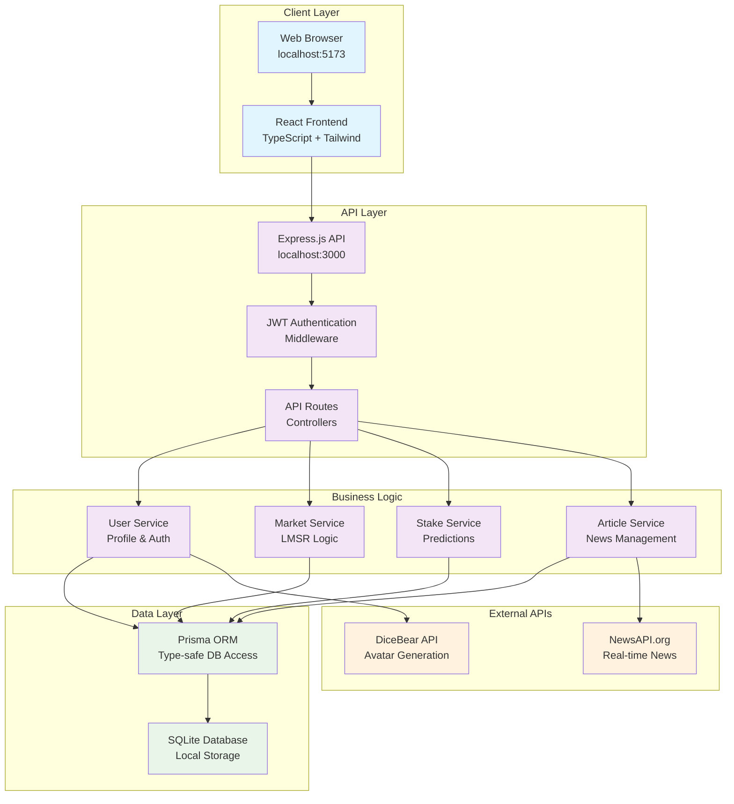
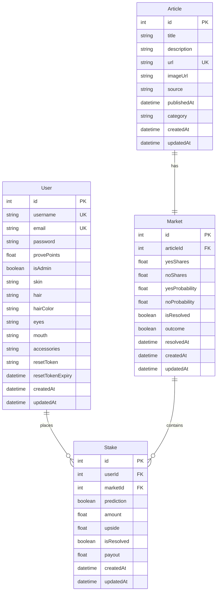

<div align="center">
  <h2><strong>Provn.io: Crowdsourcing news verification</strong></h2>
</div>


Provn.io is a prediction markets platform for news verification that harnesses the collective intelligence of online users to dramatically scale verification efforts through prediction markets. We mobilise users by giving them a stake in truthfulness, encouraging them to stake virtual ProvePoints to predict whether claims in news articles are true or fake. 

Not only does this allow us to gauge crowd sentiment about the veracity of news, but it also encourages users to be thorough before staking their claims on stories. By mobilising collective efforts to detect fake news, fact-checking on Provn.io becomes not just an exercise, but a culture.- 

<div>
  <h2><strong>All your news, in one place</strong></h2>
</div>


<div>
  <h2><strong>Deep dive into each article, while tracking how much readers trust its claims</strong></h2>
</div>


<div>
  <h2><strong>Help verify articles for others while you browse, and get rewarded!</strong></h2>
</div>


<div>
  <h2><strong>Accumulate ProvePoints with your predictions to unlock new profiles!</strong></h2>
</div>


## Table of Contents

### Introduction
- [Motivation](#motivation) - Why Provn.io?
- [Core Features](#core-features) - Overview of all platform capabilities
- [Milestone 3 Features](#ms3-features) - Upcoming features for Milestone 3
- [Tech Stack](#tech-stack) - Technologies and frameworks used
- [Getting Started](#getting-started) - Installation and setup instructions
- [User Accounts & Testing](#user-accounts--testing) - Test accounts and registration

### Understanding Key Features
- [News Search Tools](#news-search-tools) - Search, filter, and search tools to craft your reading experience
- [Understanding Prediction Markets](#understanding-prediction-markets) - How markets work
- [Staking Process](#staking-process) - Step-by-step guide to making predictions
- [Avatar System](#avatar-system) - Avatar customization guide

### Technical Details
- [Project Structure](#project-structure) - Codebase organization
- [Database Schema](#database-schema) - Data model overview
- [API Endpoints](#api-endpoints) - Complete API documentation
- [Development & Testing](#development--testing) - Development workflows
- [User Journey](#user-journey) - Step-by-step user experience flow
- [Tests](#tests) - Unit, integration, and user tests 
- [SWE Practices](#swe-practices) - Software engineering best practices and architectural decisions

### Miscellaneous
- [Frequently Asked Questions](#frequently-asked-questions) - Answering FAQs on our project
- [Development Timeline](#development-timeline) - Project development phases and milestones
- [Authors](#authors-and-acknowledgments) - Project contributors


## Motivation

In today's digital landscape, **misinformation spreads faster than wildfire**, while traditional fact-checking struggles to keep pace. News outlets, social media platforms, and readers all face the same challenge: **How do we quickly and accurately determine what's true?**

### The Problem
- **Overwhelming Volume**: Thousands of news articles are published daily across countless sources
- **Speed vs. Accuracy**: Traditional fact-checking is thorough but slow, often taking days or weeks, while nascent AI solutions like Grok come with the risks of hallucinations

**The result? In this sea of information, readers increasingly struggle to know which sources to trust.**

Even major political figures may not always put forth trustable claims: Trump's declaration of a ceasefire in the Middle East was refuted 2 hours later by Iran, although a ceasefire did eventually come into effect soon after.


### Our Solution: Crowdsourced Truth
Provn.io harnesses **crowd wisdom** through prediction markets, creating a scalable, real-time verification system:

- **Collective Intelligence**: Multiple users with diverse backgrounds contribute their knowledge and analysis
- **Real-time Processing**: Markets provide instant feedback on article credibility as news breaks
- **Skin in the Game**: Users stake ProvePoints on their predictions, incentivizing accuracy over speed
- **Probability-based Truth**: Instead of binary true/false, we provide nuanced probability scores
- **Self-correcting**: Markets automatically adjust as new information emerges

### Why Prediction Markets Work
Research consistently shows that prediction markets are among the most accurate forecasting mechanisms available. By **monetizing accuracy**, we create powerful incentives for users to:
- Research thoroughly before staking
- Update their predictions based on new evidence  
- Contribute specialized knowledge in their areas of expertise

**The result?** A scalable, democratic approach to news verification that grows more accurate as more people participate.

## Core Features

### User Accounts & Authentication
- **User Account Creation**: Robust signup with email validation, password strength requirements, and duplicate prevention
- **Secure Authentication**: JWT-based authentication with proper password hashing, input validation, and protection against common attacks
- **Profile Management**: User profile pages with personalized statistics and staking history
- **Admin Features**: Administrative controls for determining veracity of new articles and resolving markets as needed

### News Integration & Article Management
- **Real-time News Fetching**: Integration with NewsAPI.org for fetching real-world news articles
- **Article Display**: Rich article cards with source attribution, publication dates, and category tags
- **Diverse Categories**: Articles across business, entertainment, health, science, sports, and technology
- **Search & Sorting**: Filter articles by keyword search and sort for new, trending, trusted, or contentious articles

### Prediction Markets System
- **Automatic Market Creation**: Prediction markets are automatically created for each news article, allowing users to predict TRUE or FALSE on news article claims
- **Completely Liquid Markets**: Users place stakes with the Provn.io platform directly, instead of staking against other users, which allows stakes to be placed quickly and easily with Provn.io's automated market making
- **Real-time Probability Updates with LMSR**: Market probabilities predicting the veracity of news with the Logarithmic Market Scoring Rule update dynamically based on user stakes
- **Market Statistics**: Comprehensive statistics showing total participants, stake amounts, and probability distributions
- **Market Resolution**: Admin-controlled market resolution with automatic payout calculation

### ProvePoints Economy
- **Virtual Currency**: ProvePoints (PP) serve as the platform's staking currency
- **Starting Balance**: New users receive 100 PP to begin participating
- **Stake-based Wagering**: Users stake PP on their predictions with dynamic upside calculations
- **Winning Payouts**: Automatic distribution of winnings based on market outcomes and LMSR calculations
- **Balance Management**: Real-time balance updates and insufficient funds protection

### Avatar Customization System
- **DiceBear Integration**: Avatar system powered by DiceBear's "big-smile" style
- **Comprehensive Customization**: Skin color, hair color, hair style, eyes, mouth, and accessories
- **Real-time Preview**: Instant preview of avatar changes in the editor
- **Global Display**: Avatars appear throughout the app (navbar, profile, stakes history)
- **Premium Features**: PP-gated premium avatar options, rewarding users for correct predictions with cosmetic features to customise their profile

## MS3 Features
- **Timezone Specific Articles**: The time of publishing and time of market resolution attached to each article is now standardised to GMT+8/SGT for greater clarity for a global audience
- **Stake Management**: Allow users to interact with the "My Stakes" segment of the Profile Page, and ensure that stakes are properly distributed to users upon market resolution
- **User Generated Articles**: Allow users to publish their own articles attributed to their profiles on the platform, allowing our platform to host developing news stories that are validated with our prediction market system. Users can post their own corroborations and explainers giving larger contexts around news stories.
- **Automatic Market Closure**: Allow markets to resolve by their stipulated times automatically instead of relying upon admin verification.
- **Simulated Markets**: Use bot accounts to randomly stake on news articles, increasing trading volume in order to more effectively display Provn.io's user experience once a userbase has been built.
- **Guided Walkthrough**: Users can experience a guided walkthrough taking them through the core functionality of Provn.io, to help new users get the hang of things faster

## Tech Stack

### Frontend
- **React 19** with TypeScript for type-safe component development
- **Tailwind CSS** for modern, responsive styling with custom glass-morphism effects
- **Vite** for fast development builds and hot module replacement
- **React Router** for client-side routing and navigation
- **React Hot Toast** for user notifications and feedback

### Backend
- **Node.js** with Express.js for RESTful API development
- **TypeScript** for full-stack type safety
- **Prisma ORM** with SQLite database for data persistence
- **JWT** for stateless authentication
- **bcrypt** for secure password hashing
- **CORS** for cross-origin resource sharing

### External Integrations
- **NewsAPI.org** for real-time news article fetching
- **DiceBear API** for avatar generation and customization

## Getting Started

### Prerequisites
- Node.js (version 16 or higher)
- npm or yarn package manager
- SQLite3 (for database)

### Installation & Setup

1. **Clone the repository**
   ```bash
   git clone <repository-url>
   cd provn-orbital25
   ```

2. **Install dependencies**
   ```bash
   npm run install:all
   ```
   This installs dependencies for the root, backend, and frontend.

3. **Environment Configuration**
   
   **Backend Setup:**
   - Copy `backend/.env.example` to `backend/.env`
   - Configure your environment variables:
     ```env
     DATABASE_URL="file:./prisma/dev.db"
     JWT_SECRET="your-jwt-secret-key"
     NEWS_API_KEY="your-newsapi-key-from-newsapi.org"
     ```

   **News API Setup:**
   - Visit [NewsAPI.org](https://newsapi.org/) and create a free account
   - Get your API key and add it to the `.env` file
   - Free tier provides 1,000 requests per day

4. **Database Setup**
   ```bash
   cd backend
   npx prisma generate
   npx prisma db push
   ```

5. **Create Initial Data**
   ```bash
   # Create admin user (username: admin, password: password123)
   node scripts/createAdminUser.js
   
   # Create test user (username: testuser, password: password123)
   node scripts/createTestUser.js
   
   # Fetch real news articles and create markets
   node scripts/fetchRealNews.js
   ```

6. **Start Development Servers**
   ```bash
   # From root directory - starts both backend and frontend
   npm run dev
   
   # Or start individually:
   npm run dev:backend   # Backend on http://localhost:3000
   npm run dev:frontend  # Frontend on http://localhost:5173
   ```

7. **Access the Application**
   - **Frontend**: http://localhost:5173
   - **Backend API**: http://localhost:3000
   - **Database Browser**: Run `npx prisma studio` in backend directory (http://localhost:5555)

### Available Scripts

**Root Level:**
- `npm run dev` - Start both backend and frontend in development mode
- `npm run build` - Build both backend and frontend for production
- `npm run test` - Run tests for both backend and frontend
- `npm run install:all` - Install dependencies for all packages

**Backend Scripts:**
- `npm run dev` - Start backend development server with hot reload
- `npm run build` - Build backend for production
- `npm test` - Run backend tests

**Frontend Scripts:**
- `npm run dev` - Start frontend development server
- `npm run build` - Build frontend for production
- `npm run preview` - Preview production build

## User Accounts & Testing

### Test User Accounts

For testing and development purposes, you can use these pre-configured accounts:

#### Regular Test User
- **Username:** `testuser`
- **Email:** `test@example.com`
- **Password:** `password123`
- **Starting Balance:** 100 PP

#### Admin User
- **Username:** `admin`
- **Email:** `admin@example.com`
- **Password:** `password123`
- **Starting Balance:** 10,000 PP
- **Admin Features:** Market resolution, user management

These accounts come pre-configured with initial ProvePoints and can be used to:
- Test the authentication system
- Explore prediction markets and staking
- Test avatar customization features
- View performance analytics
- (Admin only) Resolve markets and manage content

### Creating Your Own Account
You can also register a new account through the registration page, which provides:
- 100 PP starting balance
- Full access to all platform features
- Persistent data storage
- Avatar customization options

## News Search Tools

Provn.io provides powerful search and filtering capabilities to help you find the news articles that matter most to you: 

- **Search Bar**: Using keyword search, find specific articles by searching for terms, phrases, or topics
- **Category Filtering**: Filter by news categories including: Business & Finance, Entertainment & Media, Health & Medicine, Science & Technology, Sports & Recreation, or just General News!

### Sorting Options
- **Newest First**: See the latest breaking news and developments
- **Trending**: Articles with the most user engagement and activity
- **Most Trusted**: Articles with high probability scores indicating credibility
- **Most Contentious**: Articles with close to 50/50 market probabilities

These tools help you quickly find articles that match your interests and expertise, making it easier to make informed predictions in areas where you have knowledge.

## Understanding Prediction Markets

### How Markets Work
In essence, prediction markets function by comparing the number of "shares" bought for each outcome, TRUE or FALSE. Thus, by comparing the stakes each reader places for each article, each market can suggest a probability of the article containing trustable claims by gauging crowd sentiment: if 999 of 1000 readers think that the article is true, it probably is!

To avoid a small number of votes from disrupting the market too heavily, we set a high liquidity parameter and limit the possibility for market manipulation. Nevertheless, we continue to advise users to exercise their own discretion when reading claims in every news article.

Here's a snippet of our code that predicts the probability of fake news:
```
// Calculates LMSR odds for a given market.
// LIQUIDITY = 1000; this means 1000PP moves the probabilities from 50% to 73%, and 2000PP moves it to 88%.
  async getImpliedProbability(marketId: number): Promise<{ probTrue: number; probFalse: number }> {
    const market = await this.getMarketById(marketId);
    const expTrue = Math.exp(market.sharesTrue / LIQUIDITY);
    const expFalse = Math.exp(market.sharesFalse / LIQUIDITY);
    const denom = expTrue + expFalse;

    return {
      probTrue: expTrue / denom,
      probFalse: expFalse / denom,
    };
  }
```

## LMSR Logic in Our Prediction Markets

Our platform uses the **Logarithmic Market Scoring Rule (LMSR)** as the automated market maker for all prediction markets. LMSR is a popular mechanism for prediction markets because it provides continuous liquidity and automatically adjusts prices (probabilities) based on the stakes placed by users. This ensures that users can easily place stakes at any time, while also allowing the platform to detect shifts in sentiment—**serving as an early warning system for potential misinformation.**

### How LMSR Works

- **Shares System:**  
  In a traditional LMSR market, users buy and sell "shares" in possible outcomes. The price of each share is determined by the current distribution of shares and the market's liquidity parameter. As more shares are bought for an outcome, its implied probability (and price) increases.

- **Price Calculation:**  
  The LMSR formula ensures that the cost to move the market probability increases as the market becomes more certain. This prevents any single user from drastically moving the market with a small stake.

### User-Friendly Abstraction

To make the experience more intuitive, we **abstract away the concept of shares**. Instead, users interact with the market using **ProvePoints (PP)**, our platform's staking currency.

- **Direct Upside Visualization:**  
  When a user stakes ProvePoints on an outcome, the platform calculates and displays their **expected upside** (potential gain per PP staked) using the underlying LMSR math. This means users don't need to understand or manage shares—they simply see how much they stand to gain if their prediction is correct.

- **Behind the Scenes:**  
  - When a user stakes, the system uses LMSR to determine how many "virtual shares" their stake would buy.
  - The market's probabilities (odds) are updated based on the new share distribution.
  - The user's upside is calculated and shown directly, making the process transparent and user-friendly.

### Example

Suppose the market is 50/50 and you stake 100 PP on "Yes":
- The system calculates, via LMSR, how much this moves the probability.
- You immediately see your **upside per PP** and the new market odds.
- No need to worry about shares or complex formulas—just stake and see your potential reward.

## Staking Process

Making predictions on Provn.io is designed to be intuitive and rewarding. Here's your complete guide to staking:

### Step-by-Step Staking Guide

#### 1. **Conduct Thorough Research**
- Read the news article fully
- Consult other news sources to ensure that its claims can be trusted
- Check the current probability and market activity to evaluate if the market probability matches your assessment

#### 2. **Make Your Prediction**
- Click either **"TRUE"** or **"FALSE"** based on your analysis
- Enter how many ProvePoints you want to stake (minimum 1 PP)
- **View Upside**: See your potential return multiplier in real-time

#### 3. **Place Your Stake!**
```
Your Prediction: TRUE
Stake Amount: 25 PP
Current Odds: 1.7x
Potential Return: 42.5 PP
Net Profit: 17.5 PP
```
- Double-check all details before confirming
- Click **"Place Stake"** to submit your prediction

#### 4. **Track Your Position**
- Your stake appears immediately in your Profile page
- Monitor market probability changes in real-time
- Watch as new information affects market sentiment
- Receive notifications when markets are resolved

#### 5. **Receive Your Reward**
- Receive bonus PP if you were correct
- Lose your staked amount if you were wrong

## Avatar System

Provn.io features a comprehensive avatar customization system powered by DiceBear's "big-smile" style. The cosmetic options unlock as you earn more and more ProvePoints, allowing you to show off your astute predictions in style to everyone!

### How to Customize Your Avatar
1. Navigate to your Profile page or click "Avatar Shop" in the navigation
2. Click on your current avatar image or use the Avatar Editor page
3. Choose from different customization categories (skin, hair, eyes, mouth, accessories)
4. Premium features require sufficient ProvePoints to unlock
5. Save your changes to update your profile across the platform

## Project Structure

### System Architecture Diagram



### Directory Structure

```
provn-orbital25/
├── backend/                    # Node.js Express API server
│   ├── prisma/                # Database schema and migrations
│   ├── scripts/               # Utility scripts for data management
│   ├── src/
│   │   ├── controllers/       # API route handlers
│   │   ├── middleware/        # Authentication and validation
│   │   ├── routes/           # API route definitions
│   │   ├── services/         # Business logic (Markets, Stakes, Users)
│   │   └── tests/            # Unit and integration tests
│   └── public/               # Static files and test pages
├── frontend/                  # React TypeScript application
│   ├── public/               # Static assets
│   └── src/
│       ├── components/       # Reusable UI components
│       ├── contexts/         # React context providers
│       ├── pages/           # Page components
│       ├── services/        # API communication
│       └── utils/           # Helper functions and types
└── shared/                   # Shared TypeScript types
```

## Database Schema

### Database Entity Relationship Diagram (ERD)

The application uses SQLite with Prisma ORM. Key models include:

### User Model
- Authentication data (username, email, password)
- ProvePoints balance and admin status
- Avatar configuration (skin, hair, eyes, mouth, accessories)
- Timestamps and reset tokens

### Article Model
- News article content (title, description, URL, image)
- Source attribution and publication date
- Category classification
- Associated prediction market

### Market Model
- Article association and outcome tracking
- LMSR parameters (shares, probabilities)
- Resolution status and timestamps
- Associated stakes

### Stake Model
- User prediction and stake amount
- Upside calculation and resolution status
- Market and user associations
- Creation timestamp



#### Sample Data Examples:
- **User**: `{ username: 'testuser', email: 'test@example.com', provePoints: 100.00, isAdmin: false }`
- **Article**: `{ title: 'Breaking News...', source: 'BBC News', category: 'technology' }`
- **Market**: `{ yesShares: 50.0, noShares: 50.0, yesProbability: 0.5, isResolved: false }`
- **Stake**: `{ prediction: true, amount: 10.0, upside: 1.95, isResolved: false }`

## API Endpoints

### Authentication Endpoints
- `POST /api/auth/register` - Register new user account
- `POST /api/auth/login` - User login with email/username and password
- `GET /api/auth/profile` - Get current user profile (protected)
- `PUT /api/auth/profile` - Update user profile (protected)
- `PUT /api/auth/update-avatar` - Update user avatar configuration (protected)

### Article Endpoints
- `GET /api/articles` - Get all articles with optional filtering
- `GET /api/articles/categories` - Get available article categories
- `POST /api/articles/refresh` - Fetch new articles from News API (admin)

### Market Endpoints
- `GET /api/markets` - Get all prediction markets
- `GET /api/markets/:id` - Get specific market by ID
- `GET /api/markets/:id/staking-parameters` - Calculate staking parameters for a prediction
- `PUT /api/markets/:id/resolve` - Resolve market outcome (admin)
- `PUT /api/markets/:id/admin-resolve` - Admin resolve market (admin)

### Stake Endpoints
- `POST /api/stakes` - Create new stake (protected)
- `GET /api/stakes/user` - Get current user's stakes (protected)
- `GET /api/stakes/market/:marketId` - Get stakes for specific market
- `GET /api/stakes/stats/:marketId` - Get market statistics

### User Endpoints
- `GET /api/users/me` - Get current user details (protected)
- `GET /api/users/stats` - Get platform statistics

## Development & Testing

### Testing the System
1. **Authentication Testing**
   ```bash
   cd backend
   node test-auth.js
   ```

2. **News API Testing**
   ```bash
   cd backend
   node scripts/testNewsAPI.js
   ```

3. **Stake Integration Testing**
   ```bash
   cd backend
   node scripts/testStakeIntegration.js
   ```

### Database Management
- **View Database**: Run `npx prisma studio` in backend directory
- **Reset Database**: Delete `backend/prisma/dev.db` and run `npx prisma db push`
- **Backup Database**: Copy `backend/prisma/dev.db` file

### Environment Variables
Ensure your `backend/.env` file contains:
```env
DATABASE_URL="file:./prisma/dev.db"
JWT_SECRET="your-secure-jwt-secret-key"
NEWS_API_KEY="your-newsapi-key"
PORT=3000
```

## User Journey

### Detailed User Flow Steps

#### 1. **New User Onboarding**
```
Landing Page → Registration → Welcome Email → Dashboard
↓
• User sees compelling banner and feature gallery
• Creates account with email/username/password
• Receives 100 ProvePoints starting balance
• Guided tour of main features
```

#### 2. **First Article Interaction**
```
News Page → Article Selection → Market Analysis → Stake Decision
↓
• Browse real-time news articles
• Click article to view details and market
• See current probability (e.g., 65% TRUE, 35% FALSE)
• Analyze potential upside calculations
```

#### 3. **Making Predictions**
```
Stake Interface → Amount Input → Confirmation → Market Update
↓
• Choose TRUE or FALSE prediction
• Set ProvePoints stake amount (e.g., 20 PP)
• View upside potential (e.g., 1.5x return)
• Confirm stake and see updated market odds
```

#### 4. **Profile & Progress Tracking**
```
Profile Page → Stakes History → Performance Analytics → Avatar Shop
↓
• View total PP balance and earnings
• Track active and resolved stakes
• See win/loss ratios and accuracy stats
• Access avatar customization options
```

#### 5. **Avatar Customization Flow**
```
Avatar Editor → Feature Selection → PP Check → Preview → Save
↓
• Select customization category (hair, eyes, etc.)
• Check PP requirements for premium features
• Preview changes in real-time
• Save configuration to profile
```

#### 6. **Market Resolution & Payouts**
```
Admin Resolution → Automatic Calculation → Payout Distribution → Balance Update
↓
• Admin resolves market based on real outcomes
• LMSR calculates winnings for correct predictions
• ProvePoints automatically distributed
• User notified of winnings/losses
```

### User Personas & Journeys

#### **The Analyst** - Sarah, News Enthusiast
- **Goal**: Earn PP through careful news analysis
- **Journey**: Reads multiple sources → Cross-references information → Strategic staking → Long-term accuracy
- **Pain Points**: Complex markets, information overload
- **Success Metrics**: High accuracy rate, steady PP growth

#### **The Casual Predictor** - Mike, Quick Decision Maker  
- **Goal**: Fun engagement with current events
- **Journey**: Quick browsing → Gut feeling predictions → Immediate feedback → Avatar collection
- **Pain Points**: Complex explanations, technical jargon
- **Success Metrics**: Enjoyable experience, avatar unlocks

#### **The News Skeptic** - Linda, Fact Checker
- **Goal**: Combat misinformation through verification
- **Journey**: Deep research → Evidence-based staking → Community validation → Market influence
- **Pain Points**: Slow resolution times, bias concerns
- **Success Metrics**: Accurate markets, reduced misinformation

## Tests

Provn.io includes a comprehensive test suite with 74 tests across 11 test suites, ensuring platform reliability and functionality. All tests use Jest with TypeScript and include proper database isolation to prevent test interference.

### Test Architecture

#### **Test Isolation System**
- **Sequential Execution**: Tests run sequentially (`maxWorkers: 1`) to prevent database conflicts
- **Unique Database Instances**: Each test suite uses isolated database instances with unique keys
- **Automatic Cleanup**: Database state is reset between test suites using custom TestSetup utilities
- **Mutex Protection**: Database operations are protected with mutex locks to ensure data integrity

### Test Categories

#### **1. Authentication Tests** (`auth.test.ts`)
**Coverage**: User registration, login, and protected route access
- **Registration Tests**: Valid user creation, duplicate prevention, password validation, email format validation
- **Login Tests**: Username/email authentication, invalid credential handling, missing field validation  
- **Protected Route Tests**: JWT token validation, authorization middleware, malformed header handling
- **Security Features**: Password hashing, input sanitization, duplicate username/email prevention

#### **2. Authentication Service Tests** (`unit/AuthenticationService.test.ts`)
**Coverage**: User management and profile operations
- **User Registration**: Account creation with proper defaults, avatar initialization, duplicate prevention
- **Profile Management**: Avatar configuration updates, purchase tracking, balance integrity
- **Data Validation**: User lookup operations, null handling for non-existent users

#### **3. Basic Database Tests** (`basic.test.ts`)
**Coverage**: Core database connectivity and CRUD operations
- **Database Connection**: Prisma client connectivity verification
- **Entity Creation**: User, article, and market creation and retrieval
- **Data Integrity**: Relationship validation between users, articles, and markets

#### **4. Service Layer Tests**

##### **Article Service** (`services/ArticleService.test.ts`)
- **Article Management**: Article creation with proper metadata
- **Data Retrieval**: Article lookup by ID with validation

##### **Market Service** (`services/MarketService.test.ts`) 
- **Market Creation**: Automated market generation for articles
- **Market Configuration**: Proper initialization with default probabilities

##### **Stake Service** (`services/StakeService.test.ts`)
- **Stake Creation**: ProvePoints validation, stake amount verification, LMSR probability updates
- **Balance Management**: User balance deduction, insufficient funds handling
- **Market Integration**: Odds calculation using Logarithmic Market Scoring Rule (LMSR)
- **Stake Tracking**: User stake arrays, stake-to-user relationship validation

##### **User Service** (`services/UserService.test.ts`)
- **User Operations**: User creation, profile updates, balance management
- **Authentication**: Login validation, credential verification

##### **Cron Service** (`services/CronService.test.ts`)
- **Scheduled Tasks**: Automated news fetching, market updates, system maintenance
- **Error Handling**: Service failure recovery, retry mechanisms

#### **5. Unit Tests**

##### **Stake Service Unit Tests** (`unit/StakeService.test.ts`)
- **Error Handling**: Insufficient ProvePoints validation, invalid market ID handling, zero/negative stake prevention
- **Data Retrieval**: Empty stake arrays for new users
- **Stake Resolution**: Losing stake calculations, payout distributions

#### **6. Integration Tests**

##### **Stake Integration Tests** (`integration/stakeIntegration.test.ts`)
- **Complete Stake Flow**: End-to-end stake creation with market probability updates
- **Financial Validation**: ProvePoints deduction, upside calculation accuracy
- **Market Dynamics**: LMSR probability calculations, stake statistics tracking
- **Error Scenarios**: Invalid user/market IDs, insufficient funds, edge case handling

### Running Tests

#### **Full Test Suite**
```bash
cd backend
npm test
```

### Test Results Summary
- **11/11 Test Suites Passing**
- **74/74 Individual Tests Passing**

### Key Testing Features

#### **Database Management**
- Isolated test databases prevent data contamination
- Automatic cleanup between test suites
- Proper relationship testing between entities

#### **Authentication Security**
- JWT token validation and expiration handling
- Password hashing verification
- Input sanitization and validation

#### **Financial Integrity**
- ProvePoints balance validation
- LMSR probability calculation accuracy
- Stake payout verification

#### **API Endpoint Coverage**
- User registration and authentication endpoints
- Article and market management APIs
- Stake creation and resolution endpoints
- Profile and balance management APIs

#### **Error Handling**
- Graceful handling of invalid inputs
- Proper error messages and status codes
- Edge case scenario coverage

### Test Configuration

#### **Jest Configuration** (`jest.config.js`)
```javascript
module.exports = {
  preset: 'ts-jest',
  testEnvironment: 'node',
  setupFilesAfterEnv: ['<rootDir>/src/tests/setup/jest.setup.ts'],
  maxWorkers: 1, // Sequential execution for database isolation
  testTimeout: 30000,
  verbose: true
};
```

#### **Test Setup** (`src/tests/setup/testSetup.ts`)
- Custom TestSetup class for database management
- Unique instance key generation for test isolation
- Automated user, article, and market creation utilities
- Database cleanup and reset functionality

The test suite ensures Provn.io's reliability across all core features including user authentication, prediction markets, financial transactions, and news article management. All tests maintain independence through proper isolation mechanisms and comprehensive cleanup procedures.

## SWE Practices

Provn.io demonstrates comprehensive software engineering best practices across architecture, development, testing, and maintenance. These practices ensure code quality, maintainability, scalability, and team collaboration.

### Code Organization & Architecture

#### **Modular Architecture with Clear Separation of Concerns**
```
├── backend/src/
│   ├── controllers/     # API route handlers (presentation layer)
│   ├── services/        # Business logic (service layer)
│   ├── middleware/      # Cross-cutting concerns
│   ├── routes/          # API route definitions
│   └── models/          # Data models via Prisma
```

**Benefits:**
- **Maintainability**: Each layer has distinct responsibilities, making code easier to understand and modify
- **Testability**: Business logic is separated from API concerns, enabling focused unit testing
- **Scalability**: New features can be added without affecting existing components
- **Team Collaboration**: Developers can work on different layers simultaneously

#### **Dependency Injection & Service Pattern**
```typescript
// Example: StakeService depends on MarketService, UserService
export class StakeService {
  constructor(
    private marketService: MarketService,
    private userService: UserService
  ) {}
}
```

**Benefits:**
- **Loose Coupling**: Services are easily replaceable and mockable for testing
- **Single Responsibility**: Each service handles one domain area
- **Reusability**: Services can be used across multiple controllers and contexts

### Type Safety & Code Quality

#### **Full-Stack TypeScript Implementation**
- **Frontend**: React with TypeScript for component type safety
- **Backend**: Node.js with TypeScript for API and business logic
- **Shared Types**: Common interfaces in `/shared/types.ts`

**Benefits:**
- **Early Error Detection**: Compile-time catching of type mismatches and null reference errors
- **Refactoring Safety**: Breaking changes are caught at compile time

#### **Database Type Safety with Prisma ORM**
```typescript
// Auto-generated types ensure database schema alignment
const user: User = await prisma.user.findUnique({
  where: { id: userId },
  include: { stakes: true }
});
```

**Benefits:**
- **Schema-Code Synchronization**: Database changes automatically update TypeScript types
- **Query Safety**: Prevents invalid database queries at compile time
- **Migration Management**: Version-controlled database schema evolution
- **Performance**: Generated queries are optimized and type-safe

### Testing Strategy & Quality Assurance

#### **Comprehensive Test Coverage (74 Tests Across 11 Suites)**
- **Unit Tests**: Individual service and component testing
- **Integration Tests**: End-to-end workflow validation
- **API Tests**: HTTP endpoint behavior verification
- **Database Tests**: Data persistence and retrieval validation

**Benefits:**
- **Regression Prevention**: Changes that break existing functionality are caught immediately
- **Refactoring Confidence**: Code can be improved without fear of breaking existing features
- **Documentation**: Tests serve as executable specifications of system behavior
- **Quality Assurance**: Ensures all features work as intended across different scenarios

#### **Test Isolation & Database Management**
```typescript
// Each test suite uses isolated database instances
const testSetup = new TestSetup(`test-${Date.now()}-${Math.random()}`);
```

**Benefits:**
- **Parallel Testing**: Tests can run independently without data contamination
- **Deterministic Results**: Test outcomes are consistent across runs
- **Clean State**: Each test starts with a known, clean database state
- **Debugging**: Failed tests can be easily reproduced and debugged

### Security & Authentication

#### **JWT-Based Authentication with Proper Security Practices**
```typescript
// Secure password hashing
const hashedPassword = await bcrypt.hash(password, 10);

// JWT token validation middleware
const token = req.headers.authorization?.split(' ')[1];
const decoded = jwt.verify(token, process.env.JWT_SECRET);
```

**Benefits:**
- **Stateless Authentication**: Scalable across multiple server instances
- **Security**: Passwords are properly hashed, tokens have expiration
- **Authorization**: Protected routes ensure proper access control
- **Standards Compliance**: Follows industry-standard authentication patterns

#### **Input Validation & Sanitization**
```typescript
// Request validation using middleware
app.use('/api/stakes', validateStakeInput, stakeController);

// SQL Injection Prevention through Prisma ORM
const stakes = await prisma.stake.findMany({
  where: { userId: parseInt(userId) } // Type-safe parameter binding
});
```

**Benefits:**
- **Attack Prevention**: Protects against SQL injection, XSS, and other common attacks
- **Data Integrity**: Ensures only valid data enters the system
- **Error Handling**: Provides clear feedback for invalid inputs
- **Compliance**: Meets security standards for web applications

### Development Workflow & DevOps

#### **Environment-Based Configuration Management**
```typescript
// Environment-specific settings
const config = {
  database: process.env.DATABASE_URL,
  jwtSecret: process.env.JWT_SECRET,
  newsApiKey: process.env.NEWS_API_KEY,
  port: process.env.PORT || 3000
};
```

**Benefits:**
- **Environment Separation**: Development, testing, and production use different configurations
- **Security**: Sensitive credentials are not hardcoded in source code
- **Flexibility**: Easy deployment to different environments
- **Team Collaboration**: Each developer can have custom local settings

#### **Hot Module Replacement & Development Efficiency**
```json
// Vite for frontend, nodemon for backend
"scripts": {
  "dev:frontend": "vite",
  "dev:backend": "nodemon src/index.ts",
  "dev": "concurrently \"npm run dev:backend\" \"npm run dev:frontend\""
}
```

**Benefits:**
- **Fast Development Cycle**: Changes are reflected immediately without full rebuilds
- **Developer Experience**: Reduces context switching and waiting time
- **Productivity**: Enables rapid prototyping and iterative development
- **Debugging**: Live debugging with immediate feedback

### Code Maintainability & Documentation

#### **Comprehensive Documentation Strategy**
- **README.md**: Complete project documentation with setup instructions
- **API Documentation**: Detailed endpoint specifications with examples
- **Code Comments**: Inline documentation for complex business logic
- **Type Definitions**: Self-documenting interfaces and types

**Benefits:**
- **Onboarding**: New developers can quickly understand and contribute to the project
- **Knowledge Preservation**: Critical information is preserved beyond individual team members
- **API Usability**: Clear documentation enables easy integration and testing
- **Maintenance**: Future modifications are guided by documented intentions

#### **Consistent Code Formatting & Standards**
```json
// ESLint and Prettier configuration
{
  "extends": ["@typescript-eslint/recommended"],
  "rules": {
    "no-unused-vars": "error",
    "prefer-const": "error"
  }
}
```

**Benefits:**
- **Team Consistency**: All code follows the same style guidelines
- **Readability**: Consistent formatting improves code comprehension
- **Error Prevention**: Linting catches common mistakes before runtime

### Performance & Scalability

#### **Efficient Database Queries with LMSR Optimization**
```typescript
// Optimized probability calculations
async getImpliedProbability(marketId: number) {
  const market = await this.getMarketById(marketId);
  const expTrue = Math.exp(market.sharesTrue / LIQUIDITY);
  const expFalse = Math.exp(market.sharesFalse / LIQUIDITY);
  return { probTrue: expTrue / (expTrue + expFalse) };
}
```

**Benefits:**
- **Fast Response Times**: Efficient algorithms provide quick market updates
- **Scalability**: Mathematical optimizations handle increasing user loads
- **Real-time Updates**: Market probabilities update instantly with new stakes
- **Resource Efficiency**: Minimizes computational overhead for frequent operations

#### **Caching & Resource Management**
```typescript
// Static asset optimization and caching strategies
app.use(express.static('public', { maxAge: '1d' }));

// Database connection pooling through Prisma
const prisma = new PrismaClient({
  datasources: { db: { url: process.env.DATABASE_URL } }
});
```

**Benefits:**
- **Reduced Load Times**: Static assets are cached for faster loading
- **Database Efficiency**: Connection pooling prevents resource exhaustion
- **Bandwidth Optimization**: Reduces repeated asset downloads
- **User Experience**: Faster page loads improve user satisfaction

### Error Handling & Monitoring

#### **Comprehensive Error Handling Strategy**
```typescript
// Global error handling middleware
app.use((error: Error, req: Request, res: Response, next: NextFunction) => {
  console.error('Error:', error.message);
  res.status(500).json({ 
    error: 'Internal server error',
    message: process.env.NODE_ENV === 'development' ? error.message : undefined
  });
});
```

**Benefits:**
- **Graceful Degradation**: Errors don't crash the entire application
- **User Experience**: Users receive helpful error messages instead of cryptic failures
- **Debugging**: Detailed error information is available in development
- **Security**: Production environments don't leak sensitive error details

#### **Logging & Monitoring**
```typescript
// Structured logging for production monitoring
console.log(`[${new Date().toISOString()}] ${method} ${url} - ${statusCode}`);

// Database query monitoring
prisma.$use(async (params, next) => {
  const before = Date.now();
  const result = await next(params);
  console.log(`Query ${params.model}.${params.action} took ${Date.now() - before}ms`);
  return result;
});
```

**Benefits:**
- **Production Visibility**: Monitor application behavior in real-time
- **Performance Tracking**: Identify slow queries and bottlenecks
- **Issue Diagnosis**: Historical logs help debug production problems

### Integration & External Services

#### **Clean External API Integration**
```typescript
// NewsAPI integration with error handling
export class NewsService {
  async fetchArticles(category?: string): Promise<Article[]> {
    try {
      const response = await fetch(`${NEWS_API_URL}?apiKey=${API_KEY}&category=${category}`);
      if (!response.ok) throw new Error(`API Error: ${response.status}`);
      return await response.json();
    } catch (error) {
      console.error('News API Error:', error);
      return []; // Graceful fallback
    }
  }
}
```

**Benefits:**
- **Resilience**: Application continues functioning even if external services fail
- **Error Isolation**: External service failures don't propagate throughout the system
- **Testability**: External dependencies can be mocked for testing
- **Monitoring**: External API performance and failures are tracked

## Contributing

We welcome contributions to Provn.io! Here's how you can help:

1. **Fork the repository**
2. **Create a feature branch** (`git checkout -b feature/amazing-feature`)
3. **Commit your changes** (`git commit -m 'Add some amazing feature'`)
4. **Push to the branch** (`git push origin feature/amazing-feature`)
5. **Open a Pull Request**

### Development Guidelines
- Follow TypeScript best practices
- Maintain test coverage for new features
- Use consistent code formatting (Prettier/ESLint)
- Update documentation for API changes
- Test thoroughly before submitting PRs

## Frequently Asked Questions

### General Questions

**Q: What makes Provn.io different from traditional fact-checking?**  
A: Traditional fact-checking relies on a small number of experts and can take days or weeks. Provn.io uses prediction markets to harness collective intelligence from many users, providing real-time probability scores for news credibility.

**Q: How accurate are prediction markets for news verification?**  
A: Research shows prediction markets are among the most accurate forecasting mechanisms available. By incentivizing accuracy through ProvePoints, users are motivated to research thoroughly before making predictions.

**Q: Do I need to understand complex market mechanics to use Provn.io?**  
A: Not at all! We've designed the interface to be user-friendly. Simply stake ProvePoints on whether you think a news claim is true or false, and we'll show you your potential returns clearly.

### ProvePoints & Economy

**Q: How do I earn more ProvePoints?**  
A: Make accurate predictions! When markets resolve in your favor, you earn ProvePoints based on your stake amount and the market odds. The more accurate your predictions, the more you earn.

**Q: What happens if I run out of ProvePoints?**  
A: You won't be able to place new stakes until you earn more PP. However, you can still browse articles, view market probabilities, and track existing stakes.

**Q: Can I lose all my ProvePoints?**  
A: Yes, if your predictions are consistently wrong, you'll lose the PP you stake. This creates the incentive structure that makes prediction markets effective - users must be thoughtful about their predictions.

### Avatar System

**Q: How do I unlock premium avatar features?**  
A: Earn ProvePoints through successful predictions, then spend them in the Avatar Editor. Different features have different costs: hair styles (50 PP), eyes/mouth (30 PP), accessories (100 PP).

**Q: Do avatar purchases affect my staking balance?**  
A: Yes, avatar customizations require ProvePoints as a prerequisite (not a deduction). This rewards accurate predictors with cosmetic features to show off their success.

### Technical Questions

**Q: How do market probabilities update?**  
A: We use the Logarithmic Market Scoring Rule (LMSR) which automatically adjusts probabilities based on the stakes placed by users. More stakes on one outcome increase its probability.

**Q: Who decides when markets are resolved?**  
A: Currently, platform administrators resolve markets based on authoritative sources and real-world outcomes. We're exploring community-driven resolution mechanisms for the future.

**Q: Is my data secure?**  
A: Yes, we use industry-standard security practices including JWT authentication, password hashing, and input validation to protect user accounts and data.

## Development Timeline

🛠 **Development Timeline for Provn.io**

This timeline documents the comprehensive development journey of Provn.io from initial planning to production deployment, spanning from May 4 to July 27, 2025.

### Phase 1: Initial Planning and Setup (May 4 – May 6)
**Goals**: Define project direction, learn core technologies, and lay foundational backend/frontend structure.

#### **May 4**
- **Project Planning & Requirements Analysis** (Joel, Yulun)
  - Defined core concept of crowdsourced news verification through prediction markets
  - Established technical requirements and feature specifications
  - Selected technology stack (React, TypeScript, Node.js, Prisma)

- **Learning React TypeScript Fundamentals** (Joel, Yulun)
  - Team training on React with TypeScript best practices
  - Understanding component architecture and type safety principles

#### **May 5**
- **Initial Backend Setup** (Joel, Yulun)
  - Created API server with TypeScript configuration
  - Established project structure and basic routing

- **Frontend Testing** (Yulun)
  - Created initial React application with Vite
  - Set up Tailwind CSS for styling framework
  - Tested component rendering and basic functionality

#### **May 6**
- **Frontend Editing** (Yulun)
  - Developed initial UI components and layout structure
  - Implemented basic navigation and page routing
  - Created foundational styling and design system

### Phase 2: Core Feature Implementation (May 14 – June 1)
**Goals**: Set up backend functionality and user authentication flows.

#### **May 14–17**
- **Database Design and Initial API Implementation** (Joel)
  - Designed comprehensive database schema for users, articles, markets, and stakes
  - Implemented core API endpoints for CRUD operations
  - Set up Prisma migrations and database relationships
  - Created initial service layer for business logic

#### **May 26 – June 1**
- **Login + Authentication Implementation** (Yulun)
  - Developed user registration and login forms
  - Implemented JWT-based authentication system
  - Created protected route components and authentication context
  - Added password validation and security measures

### Phase 3: Mid-Project Testing and UI Enhancements (June 20 – June 30)
**Goals**: Begin refining frontend, test integrations, and introduce stake-based market logic.

#### **June 20–24**
- **Frontend Polishing** (Yulun)
  - Enhanced UI components with improved styling and animations
  - Implemented responsive design for mobile compatibility
  - Added user feedback mechanisms and loading states

#### **June 20–25**
- **News API Integration & Troubleshooting** (Yulun)
  - Integrated NewsAPI.org for real-time news article fetching
  - Implemented article display components with rich metadata
  - Resolved API rate limiting and error handling issues

#### **June 23**
- **Add Unit Tests for Backend Services** (Joel)
  - Created comprehensive test suite with Jest and TypeScript
  - Implemented test isolation and database management
  - Added authentication, service, and integration tests

- **Learn & Implement LMSR Logic into MarketService** (Joel)
  - Researched Logarithmic Market Scoring Rule mechanics
  - Implemented LMSR probability calculations for prediction markets
  - Created dynamic market updating based on user stakes

#### **June 24–25**
- **Implement Market Resolution Logic and Database Restructuring** (Joel)
  - Added admin market resolution functionality
  - Implemented automatic payout calculations using LMSR
  - Restructured database schema for improved performance

#### **June 25–27**
- **Improve NewsPage to Support Truth Probabilities and Staking** (Joel)
  - Enhanced news display with real-time probability indicators
  - Implemented staking interface with upside calculations
  - Added market statistics and participation tracking

- **Create Individual Article Pages + API Troubleshooting** (Yulun)
  - Developed detailed article view pages with market information
  - Implemented article routing and deep linking
  - Resolved API data consistency and loading issues

#### **June 26**
- **Enable npm run dev Quick Start for Both Frontend/Backend** (Joel)
  - Created unified development scripts for easy project startup
  - Implemented concurrent frontend and backend development servers
  - Added environment configuration and setup automation

#### **June 27–30**
- **Improve Profile UI, Implement Avatar Customisation** (Joel)
  - Created comprehensive user profile pages with statistics
  - Integrated DiceBear API for avatar generation
  - Implemented ProvePoints-gated avatar customization system

- **Forum Components, Debugging and Styling** (Yulun)
  - Developed discussion forum components for articles
  - Implemented comment threading and user interactions
  - Enhanced overall application styling and consistency

- **Project Poster and Video Scripting** (Yulun)
  - Created deliverable materials
  - Scripted product demonstration videos

#### **June 28–30**
- **Add Search/Sort on NewsPage, Restrict Admin Features** (Joel)
  - Implemented keyword search and category filtering
  - Added sorting options (newest, trending, trusted, contentious)
  - Created role-based access control for administrative functions

- **UI Consistency and Widget Cleanup** (Joel)
  - Standardized component styling and behavior
  - Removed unused components and optimized performance
  - Improved overall user experience flow

- **Article Readability Improvements** (Yulun)
  - Enhanced article display formatting
  - Improved content layout and visual hierarchy
  - Added accessibility features for better usability

### Phase 4: Advanced Features, UI & Visualisations (July 1 – July 14)
**Goals**: Polish user experience with visual and interactive improvements.

#### **July 1–12**
- **Forum Visual Display Improvements** (Yulun)
  - Enhanced comment and discussion interfaces
  - Improved visual feedback for user interactions
  - Added real-time updates for forum activity

#### **July 3–14**
- **Tutorial Implementation and Styling** (Yulun)
  - Created comprehensive user onboarding experience
  - Implemented guided walkthrough for new users

#### **July 5–6**
- **Market Price Visualisations & Stake Management UI** (Joel)
  - Created real-time probability visualization components
  - Implemented stake history and portfolio management
  - Added interactive charts for market trends

#### **July 6**
- **Deploy Backend on Render for Public Access** (Joel)
  - Configured production deployment on Render platform
  - Set up environment variables and database connections
  - Implemented production-ready error handling and logging

### Phase 5: Automation, Simulation, and Production Readiness (July 20 – July 23)
**Goals**: Improve UX by simulating activity and handling environment-specific configurations.

#### **July 20**
- **Automatic Article Fetching on Backend Start** (Joel)
  - Implemented automated news article synchronization
  - Created scheduled tasks for content updates
  - Added market creation automation for new articles

- **Simulated Staking with Bots for Immersive UX** (Joel)
  - Developed bot accounts for market activity simulation
  - Implemented algorithmic staking to increase market liquidity
  - Created realistic trading volume for demonstration purposes

#### **July 21**
- **Separate Startup Behaviour for Render/Local (Mock Articles for Prod)** (Joel)
  - Configured environment-specific application behavior
  - Implemented mock data generation for production demos
  - Created flexible deployment configurations

#### **July 20–23**
- **Debugging Routes/Articles** (Yulun)
  - Resolved frontend routing and navigation issues
  - Fixed article loading and display inconsistencies
  - Improved error handling and user feedback

### Phase 6: Final Features and Polish (July 24 – July 27)
**Goals**: Final debugging, automated market resolution, and deliverable prep.

#### **July 24–26**
- **General Bugfixing and Debugging** (Yulun)
  - Comprehensive testing and issue resolution
  - Performance optimization and code cleanup
  - User experience refinements and polish

#### **July 25**
- **Forum Comments Feature** (Joel)
  - Implemented comprehensive commenting system
  - Added user interaction tracking and moderation
  - Created real-time comment updates and notifications

#### **July 26–27**
- **Automated Market Resolution** (Joel)
  - Implemented time-based automatic market closure
  - Created automated outcome verification systems

- **Proper Stake Updates Post-Resolution** (Joel)
  - Implemented automatic payout distribution
  - Created balance updates and transaction history

- **Additional Test Cases** (Yulun)
  - Expanded test coverage for edge cases
  - Added integration tests for new features
  - Implemented user acceptance testing scenarios

- **Bugfixing Customisations** (Yulun)
  - Resolved avatar customization issues
  - Fixed UI inconsistencies and responsive design
  - Improved cross-browser compatibility

- **Final Updates to Poster, Video, and Deliverables** (Yulun)
  - Finalized product demonstration videos
  - Prepared project documentation and deliverables

### **Development Metrics & Achievements**

#### **Technical Milestones**
- **11 Test Suites** with 74 individual tests achieving 100% pass rate
- **Full-Stack TypeScript Implementation** ensuring type safety across the entire application
- **Comprehensive API Coverage** with 15+ endpoints for all core functionality
- **LMSR Integration** providing accurate market probability calculations
- **Production Deployment** on Render with automated CI/CD pipeline

#### **Feature Completeness**
- **User Authentication & Authorization** - Complete JWT-based system
- **News Integration** - Real-time NewsAPI.org integration with 6 categories
- **Prediction Markets** - Full LMSR implementation with automated market making
- **Avatar Customization** - DiceBear integration with ProvePoints economy
- **Search & Filtering** - Advanced article discovery and sorting capabilities
- **Admin Controls** - Market resolution and platform management tools

#### **Code Quality Achievements**
- **Modular Architecture** with clear separation of concerns
- **Comprehensive Error Handling** with graceful degradation
- **Database Type Safety** through Prisma ORM integration
- **Production-Ready Security** with input validation and authentication
- **Performance Optimization** with efficient queries and caching

This development timeline demonstrates a systematic approach to building a complex prediction markets platform, with careful attention to both technical excellence and user experience. The project successfully evolved from initial concept to production-ready platform over an intensive 12-week development cycle.

## Authors and Acknowledgments

- **Joel Tan Zhuo Yao** - Full-stack development, system architecture, and market mechanics
- **Yap Yulun** - Frontend development, UI/UX design, and user experience

---

*Provn.io - Harnessing collective intelligence for news verification through prediction markets.*
